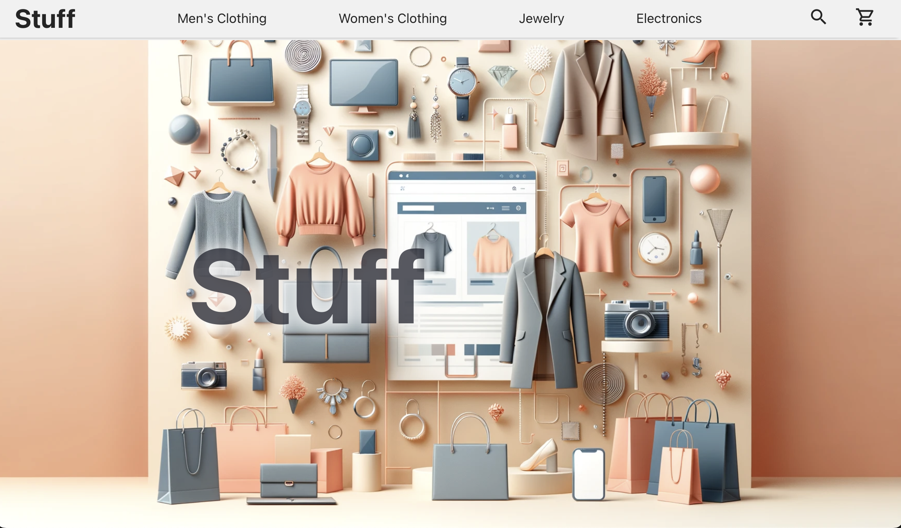
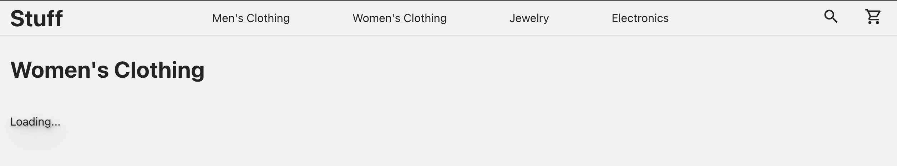
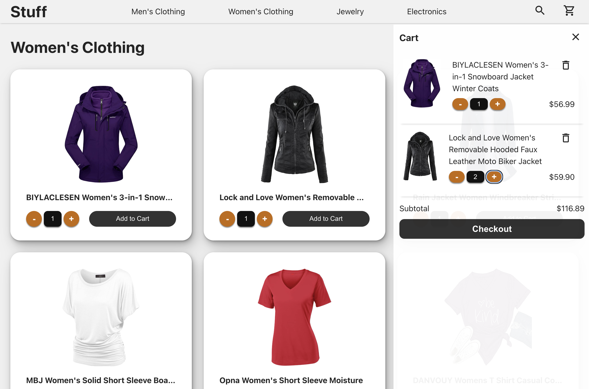

# Shopping Cart Project

This project is a Single Page Application (SPA) shopping cart built with React and Vite. It demonstrates how to build an interactive shopping interface with various features like product listing, cart management, and more.

## Description

The Shopping Cart Project is a web application designed to let users browse products, add them to their cart, and manage their cart with ease. Built with modern web technologies like React for the frontend and Vite as the build tool, this application focuses on robust application logic rather than visual aesthetics. Key features include:

- **Single Page Application (SPA) Principles**: Implemented using React Router with a shared layout across all pages.
- **API Integration**: Seamless handling of API calls using the [Fake Store API](https://fakestoreapi.com).
- **State Management**: Cart access and management across different pages using the React Context API.

## Table of Contents

- [Description](#description)
- [Screenshot](#screenshot)
- [Preview](#preview)
- [Features](#features)
- [Installation](#installation)
- [Usage](#usage)
- [Tech Stack](#tech-stack)
- [License](#license)
- [Contact Information](#contact-information)

## Screenshot

### Home Page



### Loading from API



### Flyout Cart Modal



## Preview

You can view a live preview of the page [here](https://shopping-cart-bb.netlify.app).

## Features

- **Single Page Application**: Navigates between pages without full page reloads, providing a smooth user experience.
- **Product Listing**: Displays a list of available products with details like name, image, and price.
- **Add to Cart**: Users can add products to their shopping cart with a single click.
- **Quantity Control**: Users can adjust the quantity of products in their cart, ensuring they get exactly what they need.
- **Cart Management**: View and manage items in the shopping cart from any page, including updating quantities and removing items.

## Installation

To set up the project locally, follow these steps:

1. Clone the repository:
   ```sh
   git clone https://github.com/sourdoughbredd/shopping-cart.git
   ```
2. Navigate to the project directory:
   ```sh
   cd shopping-cart
   ```
3. Install the necessary dependencies:
   ```sh
   npm install
   ```

## Usage

To start the development server and view the project in a local development environment, run:

```sh
npm run dev
```

To build the project for production, run:

```sh
npm run build
```

## Tech Stack

- HTML
- CSS
- JavaScript
- React
- Vite

## License

This project is licensed under the MIT License.

## Contact Information

For any questions or suggestions, please contact Brett Bussell at [bwbussell24@gmail.com](mailto:bwbussell24@gmail.com).
